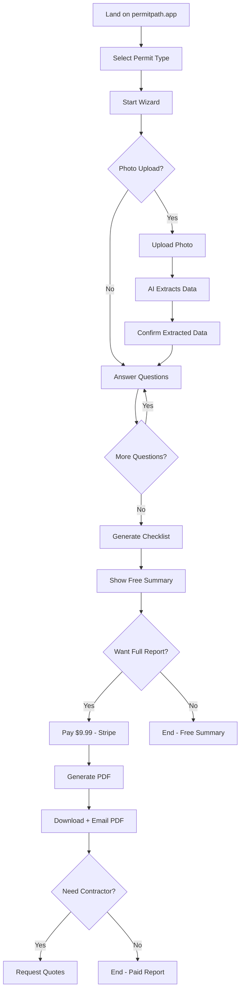
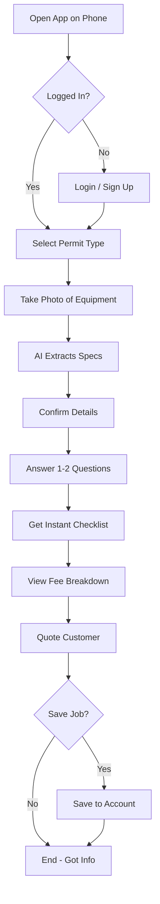
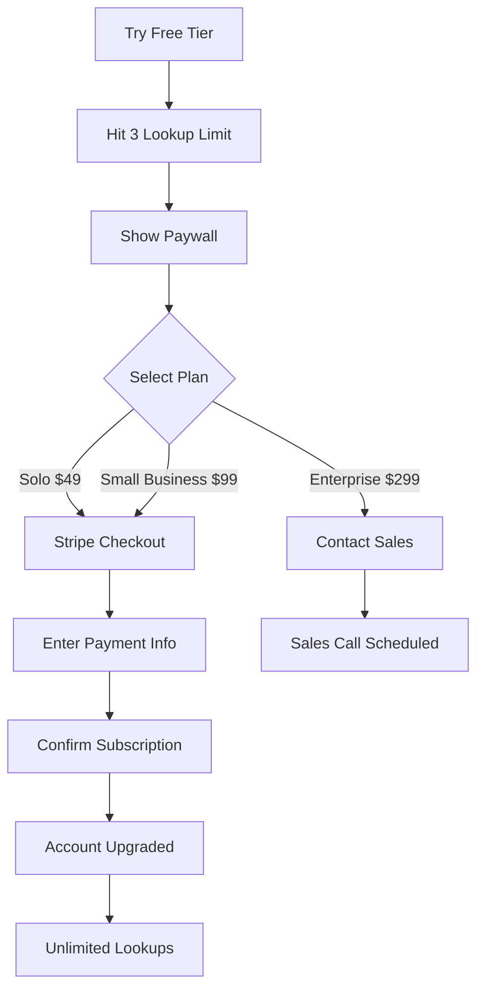

# Product Requirements Document (PRD)
## PermitPath: AI-Powered Permit Intelligence Platform

**Version:** 1.0  
**Date:** January 29, 2026  
**Status:** Draft for MVP Development  
**Owner:** Product Team  
**Contributors:** Engineering, Design, Legal, Operations

---

## Document Control

| Version | Date | Author | Changes |
|---------|------|--------|---------|
| 1.0 | 2026-01-29 | Product | Initial PRD - MVP Scope |

**Distribution:**
- Engineering Team (for implementation)
- Design Team (for UI/UX)
- Executive Team (for strategic approval)
- Investors (if applicable)

---

# Table of Contents

1. [Executive Summary](#1-executive-summary)
2. [Product Vision & Strategy](#2-product-vision--strategy)
3. [Target Users & Personas](#3-target-users--personas)
4. [Problem Statement](#4-problem-statement)
5. [Solution Overview](#5-solution-overview)
6. [Features & Requirements](#6-features--requirements)
7. [User Flows](#7-user-flows)
8. [Technical Requirements](#8-technical-requirements)
9. [Data Requirements](#9-data-requirements)
10. [UI/UX Requirements](#10-uiux-requirements)
11. [Success Metrics](#11-success-metrics)
12. [Roadmap & Phases](#12-roadmap--phases)
13. [Risks & Dependencies](#13-risks--dependencies)
14. [Go-to-Market Strategy](#14-go-to-market-strategy)
15. [Competitive Analysis](#15-competitive-analysis)
16. [Appendices](#16-appendices)

---

# 1. Executive Summary

## 1.1 Product Overview

**PermitPath** is an AI-powered permit intelligence platform that helps homeowners and contractors navigate residential building permit requirements through conversational guidance and photo-based extraction.

**Core Value Proposition:**
> "Know exactly what permits you need, how much they'll cost, and what documents are required—in under 60 seconds."

## 1.2 Market Opportunity

- **Total Addressable Market (TAM):** 20M residential permits issued annually in the US
- **Serviceable Addressable Market (SAM):** 750,000 contractors + 140M homeowners
- **Initial Market:** Pinellas County, FL (30,000 residential permits/year)

## 1.3 Business Model

| Customer Segment | Offering | Price | Revenue Model |
|------------------|----------|-------|---------------|
| **Homeowners** | Permit reports | $9.99/report | One-time purchase |
| **Contractors (Solo)** | Unlimited lookups | $49/month | SaaS subscription |
| **Contractors (Small Business)** | Team access + API | $99/month | SaaS subscription |
| **Contractors (Enterprise)** | White-label + unlimited | $299/month | SaaS subscription |

**Year 1 Revenue Target:** $330k ARR (Pinellas County only)

## 1.4 Success Criteria (12 Weeks)

| Metric | Target | Stretch |
|--------|--------|---------|
| Paid homeowner reports | 50 | 100 |
| Contractor subscriptions | 10 | 25 |
| Data accuracy validated | 95% | 98% |
| Photo extraction success | 80% | 90% |
| User NPS score | +40 | +60 |

## 1.5 Key Differentiators

1. **Photo AI Extraction:** Upload photos, auto-extract permit details (unique)
2. **Conversational UI:** Chat-based guidance vs. forms (reduces friction)
3. **Hyper-Local Accuracy:** Pinellas County-specific rules (not generic)
4. **Legal Citations:** Every step cites building code sections (trust)
5. **Mobile-First:** Optimized for on-site contractor use (practical)

---

# 2. Product Vision & Strategy

## 2.1 Vision Statement

**5-Year Vision:**
> "PermitPath becomes the standard permit intelligence platform for all residential construction in the United States, processing 5M+ permit lookups annually and reducing permit-related project delays by 40%."

**1-Year Vision (MVP):**
> "PermitPath is the go-to permit tool for Pinellas County contractors and homeowners, handling 10,000+ permit lookups and establishing 95%+ data accuracy."

## 2.2 Product Strategy

### Phase 1: Hyper-Local Dominance (Months 1-12)
**Goal:** Own Pinellas County
- Master all permit types
- Achieve 95%+ accuracy
- Build contractor network effects
- Validate revenue model

### Phase 2: Regional Expansion (Months 13-24)
**Goal:** Expand to Tampa Bay metro (5 counties)
- Add Hillsborough, Pasco, Manatee, Sarasota
- Hire local permit experts
- Template data collection process
- Target $800k-1M ARR

### Phase 3: Multi-Metro Scale (Year 3)
**Goal:** 10 metros, $5M+ ARR
- Austin, Denver, Phoenix, Charlotte, Atlanta, etc.
- Build platform for rapid jurisdiction onboarding
- Enterprise white-label offerings
- API for third-party integrations

### Phase 4: National Platform (Year 4-5)
**Goal:** Cover all major US metros
- Crowdsource contractor knowledge
- Partner with building departments
- AI-assisted data collection
- $20M+ ARR

## 2.3 Strategic Principles

1. **Hyper-Local First:** Master one jurisdiction completely before expanding
2. **Data Quality > Feature Quantity:** 95% accuracy beats 50 features
3. **Mobile-First:** Contractors use this on job sites, not desks
4. **Conversational Over Forms:** Guide users, don't quiz them
5. **Photo Intelligence:** Computer vision is our moat
6. **Trust Through Citations:** Every answer backed by legal code
7. **Network Effects:** Contractors refer contractors

## 2.4 Non-Goals (Out of Scope for MVP)

❌ **Commercial permits** (focus: residential only)  
❌ **Permit submission** (we guide, don't file)  
❌ **Contractor marketplace** (affiliate only, not direct)  
❌ **Multi-state expansion** (Pinellas County only for MVP)  
❌ **Permit tracking** (post-approval monitoring)  
❌ **CAD integration** (no AutoCAD, Revit connections)  
❌ **IoT/smart home** (no device integrations)

---

# 3. Target Users & Personas

## 3.1 Primary Personas

### Persona 1: Mike the Plumber (Solo Contractor)

**Demographics:**
- Age: 35-55
- Business: Solo plumber, 1-2 helpers
- Annual revenue: $150k-300k
- Location: Pinellas County, FL

**Behavior:**
- Does 20-30 jobs/month (water heaters, re-pipes, fixtures)
- Spends 30-45 minutes per job researching permit requirements
- Calls building department 2-3 times/week
- Uses phone for everything (not desktop)
- Low tech comfort (knows basics, not expert)

**Pain Points:**
- "I don't know if this job needs a permit until I call"
- "Fee schedules change and I mis-quote clients"
- "Waiting on hold with the permit office wastes my time"
- "I've been fined for skipping permits I didn't know about"

**Goals:**
- Quote jobs accurately (including permit fees)
- Avoid permit mistakes (fines, work delays)
- Spend less time on paperwork, more on billable work

**Quote:**
> "I just want to know: Does this job need a permit? How much? What do I need to bring? That's it."

**Jobs to Be Done:**
- Know permit requirements before quoting job
- Calculate true project cost (labor + materials + permits)
- Avoid callbacks for unpermitted work

**Success Metrics:**
- Saves 2+ hours/week on permit research
- Zero permit-related fines
- Wins more bids (accurate quotes)

---

### Persona 2: Sarah the Homeowner (DIY Enthusiast)

**Demographics:**
- Age: 35-50
- Occupation: Professional (tech, healthcare, education)
- Income: $80k-150k household
- Home: Single-family, 1,500-3,000 sq ft
- Location: Clearwater, FL (Pinellas County)

**Behavior:**
- Moderate DIY skills (can do some repairs, hires for complex)
- Researches extensively before hiring contractor
- Uses Google, YouTube, Facebook groups for home advice
- Budget-conscious but values quality
- Smartphone primary device

**Pain Points:**
- "I don't know if I need a permit for this water heater"
- "Contractors give me different answers about permits"
- "I'm afraid of fines when I sell my house"
- "Building department website is confusing"

**Goals:**
- Avoid future problems (home sale inspection failures)
- Not overpay for unnecessary permits
- Hire contractor who knows the right process
- Feel confident making home improvement decisions

**Quote:**
> "I just want to do this right so I don't have problems when I sell."

**Jobs to Be Done:**
- Determine if planned work requires permit
- Understand true project cost (permits included)
- Find trustworthy contractor who handles permits correctly

**Success Metrics:**
- Confidence in permit requirements (no anxiety)
- Saves $500-2,000 vs. unpermitted work fines
- Hires contractor with clear permit plan

---

### Persona 3: Lisa the Office Manager (Small Contracting Company)

**Demographics:**
- Age: 30-45
- Role: Office manager for 5-10 person contractor company
- Company: HVAC, electrical, or plumbing contractor
- Revenue: $1M-3M annually
- Location: Pinellas County, FL

**Behavior:**
- Manages permit applications for 50-100 jobs/month
- Coordinates between field techs and building department
- Tracks permit costs for job costing
- Uses desktop + phone
- Tech-savvy (comfortable with SaaS tools)

**Pain Points:**
- "Each city has different requirements"
- "Techs call me asking 'Does this need a permit?'"
- "I spend 10 hours/week researching permit rules"
- "We've been fined for permit mistakes"

**Goals:**
- Standardize permit process across company
- Reduce admin time on permit research
- Train new techs on permit requirements
- Avoid costly permit mistakes

**Quote:**
> "If my techs could look this up themselves, I'd save 10 hours a week."

**Jobs to Be Done:**
- Provide techs with self-service permit lookup
- Track permit costs across all jobs
- Ensure company compliance (no violations)

**Success Metrics:**
- Reduces permit research time 80%
- Zero permit violations
- Faster job quoting (techs self-sufficient)

---

## 3.2 Secondary Personas

### Persona 4: David the Permit Expediter

**Demographics:**
- Age: 40-60
- Business: Permit expediting service
- Clients: Contractors, homeowners, developers
- Revenue: $200k-500k annually
- Location: Tampa Bay area

**Behavior:**
- Processes 20-50 permits/month for clients
- Deep expertise in local building codes
- Charges $150-500 per permit
- Uses desktop + phone
- Values efficiency tools

**Pain Points:**
- "Manual permit research for every job"
- "Need to stay updated on code changes"
- "Want to scale without hiring more staff"

**Goals:**
- Increase permit throughput
- Reduce research time per permit
- White-label tool for clients

**Opportunity:**
- White-label PermitPath for $499/month
- Use backend, their branding
- They handle customer support
- Focus on complex permits (we handle simple ones)

---

## 3.3 Anti-Personas (Not Targeting)

❌ **Commercial Contractors** - Different codes, complexity (out of scope)  
❌ **DIY Hobbyists** - Too small, infrequent (low LTV)  
❌ **Large GCs** - Have in-house permit departments (won't pay)  
❌ **Real Estate Agents** - Not decision-makers for permits  
❌ **Inspectors** - Different needs (building dept employees)

---

# 4. Problem Statement

## 4.1 Core Problem

**Homeowners and small contractors waste 5-10 hours per project researching permit requirements, frequently make costly mistakes, and risk fines for unpermitted work—yet no tool exists that provides accurate, jurisdiction-specific guidance in a simple, mobile-friendly format.**

## 4.2 Problem Breakdown

### Problem 1: Information Fragmentation
**Current State:**
- Permit info scattered across building dept websites (PDFs, FAQs, phone calls)
- Different rules for unincorporated county vs. municipalities
- Codes change every 3 years, fees change quarterly
- No single source of truth

**Impact:**
- 5-10 hours wasted per project researching requirements
- Conflicting information from different sources
- Outdated information leads to mistakes

**Evidence:**
- 67% of contractors don't monitor code updates (industry survey)
- Average 3.2 phone calls to building dept per project
- Building depts report 40% of permits require resubmission (missing docs)

---

### Problem 2: High Complexity, Low Frequency
**Current State:**
- Building codes are legal documents (dense, technical)
- Each permit type has unique requirements
- Homeowners do permits 1-2x in lifetime (no experience)
- Even contractors do specific permit types infrequently

**Impact:**
- Mistakes are common (missed requirements, wrong fees)
- Anxiety about "doing it wrong"
- Contractors underbid (forget permit fees) or overbid (pad for uncertainty)

**Evidence:**
- 30% of unpermitted work discovered during home sales (inspection data)
- Average $1,500 cost to retroactively permit work
- 22% of contractor quotes exclude permit fees (underbid)

---

### Problem 3: Mobile Friction
**Current State:**
- Building dept websites designed for desktop
- Forms require typing long answers
- Can't easily photo-document current conditions
- Contractors on job sites use phones, not laptops

**Impact:**
- Contractors wait until back at office to research permits
- Delays in quoting (can't give answer on-site)
- Poor mobile UX leads to abandonment

**Evidence:**
- 78% of contractors use smartphones for work (trade survey)
- Building dept websites: 12% mobile traffic (bad UX drives users away)
- Average 8 minutes to complete paper permit checklist

---

### Problem 4: Trust Gap
**Current State:**
- Generic permit tools (HomeAdvisor, Thumbtack) give broad ranges
- Not jurisdiction-specific ("$50-500 for permit" not helpful)
- No legal citations (can't verify accuracy)
- Homeowners distrust contractors' permit advice

**Impact:**
- Decision paralysis (don't know who to trust)
- Over-reliance on building dept (clogs permit counter)
- Homeowners get multiple contractor quotes just to understand permits

**Evidence:**
- 65% of homeowners "don't trust" contractor permit advice (survey)
- Building depts report 40% of counter visits are "basic questions"
- 35% of homeowners call 2+ contractors before making permit decision

---

## 4.3 Current Alternatives (And Why They Fail)

### Alternative 1: Call Building Department
**Process:**
1. Look up building dept phone number
2. Call during business hours (8am-4pm)
3. Wait on hold (15-45 minutes average)
4. Explain project to clerk
5. Get verbal answer (may be wrong)
6. Repeat if you have follow-up questions

**Why It Fails:**
- ❌ Time-consuming (1-2 hours total per permit)
- ❌ Inconsistent answers (different clerks, different answers)
- ❌ Business hours only (can't research at night)
- ❌ No documentation (verbal advice not citable)

**User Quote:**
> "I called three times and got three different answers about whether I need a permit for my deck." - Sarah (homeowner)

---

### Alternative 2: Hire Permit Expediter
**Process:**
1. Find permit expediter (Google, referral)
2. Pay $150-500 per permit
3. Wait 24-48 hours for research
4. Get written report

**Why It Fails:**
- ❌ Expensive ($150-500 per permit)
- ❌ Overkill for simple projects (water heater)
- ❌ Slow (24-48 hour turnaround)
- ❌ Not self-service (can't iterate quickly)

**User Quote:**
> "I'm not paying $200 for someone to tell me I need a $75 permit." - Mike (plumber)

---

### Alternative 3: Generic Permit Sites (HomeAdvisor, Angi)
**Process:**
1. Search "water heater permit [city]"
2. Find generic article
3. Read broad range ("$50-300")
4. Still don't know specifics

**Why It Fails:**
- ❌ Not jurisdiction-specific (useless ranges)
- ❌ Outdated info (published years ago)
- ❌ No legal citations (can't verify)
- ❌ No interactive guidance (static articles)

**User Quote:**
> "The internet says $50-500 for a plumbing permit. That doesn't help me quote a job." - Mike (plumber)

---

### Alternative 4: Building Dept Website PDFs
**Process:**
1. Navigate building dept website
2. Download 10-20 page PDF
3. Ctrl+F for your project type
4. Cross-reference fee schedule (different PDF)
5. Hope information is current

**Why It Fails:**
- ❌ PDFs not mobile-friendly
- ❌ Hard to search/navigate
- ❌ Requires understanding legal terminology
- ❌ No interactive decision trees

**User Quote:**
> "The PDF says 'minor plumbing alterations' don't need permits. Is a water heater a minor alteration? Who knows." - Lisa (office manager)

---

## 4.4 Why Now?

**Technology Enablers:**
1. **GPT-4 Vision** - Can extract data from photos (panels, equipment labels)
2. **Mobile-First Tools** - Smartphones powerful enough for rich UX
3. **Conversational AI** - Chat interfaces feel natural (not forms)
4. **Firebase/Vercel** - Cheap infrastructure for small team

**Market Conditions:**
1. **Labor Shortage** - Contractors need efficiency tools (can't hire more staff)
2. **Code Complexity** - 2023 FBC more detailed than ever
3. **Enforcement Increase** - Building depts cracking down on unpermitted work
4. **Home Sales Scrutiny** - Inspectors flagging unpermitted work more often

**User Behavior Shift:**
1. **Mobile Adoption** - 78% of contractors use phones for work tools
2. **Chat Interfaces** - Users expect conversational UX (ChatGPT effect)
3. **Self-Service** - Don't want to call, want instant answers
4. **Photo-First** - Users prefer taking photo vs. typing info

---

# 5. Solution Overview

## 5.1 Product Concept

**PermitPath is a mobile-first, conversational AI tool that guides users through permit requirements using chat-based questions and photo extraction, providing jurisdiction-specific answers with legal citations in under 60 seconds.**

## 5.2 Core User Experience

### For Homeowners:
```
1. Visit permitpath.app
2. Select project type ("Water heater replacement")
3. Answer 3-5 conversational questions
   OR upload photo of water heater
4. Get instant answer:
   ✓ Yes, you need a permit
   ✓ Express permit ($75 fee)
   ✓ Documents needed: Tankless worksheet, photos
   ✓ Timeline: 1-3 days approval
5. Option: Download full PDF report ($9.99)
6. Option: Get 3 contractor quotes
```

**Time to answer: 60 seconds (free)**  
**Time to full report: 90 seconds ($9.99)**

### For Contractors:
```
1. Open permitpath.app on phone (on job site)
2. Select job type ("HVAC changeout")
3. Upload photo of existing equipment
4. AI extracts: Brand, model, tonnage, SEER
5. Answer: "Like-for-like replacement?"
6. Get checklist:
   ✓ Express permit required
   ✓ Fee: $95
   ✓ No load calc needed (like-for-like)
   ✓ Submit via pinellasexpress.com
7. Quote customer with accurate permit cost
8. Track permit in app (optional)
```

**Time to answer: 45 seconds**  
**Accuracy: 95%+**  
**Cost: Included in $49/month subscription**

---

## 5.3 Key Innovations

### Innovation 1: Photo AI Extraction
**Problem:** Typing equipment specs is tedious and error-prone

**Solution:** Upload photo, AI extracts details

**Example (Electrical Panel):**
```
User: [uploads panel photo]

AI extracts:
- Main breaker: 150A
- Manufacturer: Square D
- Total spaces: 30
- Empty spaces: 12
- Service type: Overhead
- Condition: Good, no rust

AI confirms: "I see a 150-amp Square D panel with 
30 spaces and about 12 empty. Sound right?"

User: "Yes"

AI continues: "Great! If you're upgrading to 
200-amp, here's what you'll need..."
```

**Tech Stack:**
- OpenAI GPT-4 Vision API
- Firebase Storage for images
- Confidence scoring (ask user to confirm if < 70%)

**Moat:** Competitors don't have this (hard to build, expensive to run)

---

### Innovation 2: Conversational Decision Trees
**Problem:** Forms are intimidating and confusing

**Solution:** Chat that asks one question at a time

**Example (Water Heater):**
```
Bot: "Hi! Let's figure out your water heater permit. 
      First question: What type are you installing?"

User: [Clicks "Tankless"]

Bot: "Perfect! Tankless water heaters need a special 
      worksheet in Pinellas County. Do you have a photo 
      of the unit or the spec sheet?"

User: [Uploads photo]

Bot: "Great! I can see it's a Rinnai RU199iN 
      (199k BTU). Now, is this gas or electric?"

User: [Clicks "Gas"]

Bot: "Got it. For a gas tankless in Pinellas County, 
      you'll need:
      
      ✓ Express permit ($85)
      ✓ Tankless worksheet (I can fill this out for you)
      ✓ Gas line inspection required
      ✓ Timeline: 1-3 days approval
      
      Want the full checklist PDF?"
```

**Why This Works:**
- One question at a time (not overwhelming)
- Friendly tone (not bureaucratic)
- Visual confirmations (photos)
- Builds context (each answer informs next question)

---

### Innovation 3: Hyper-Local Accuracy
**Problem:** Generic tools give useless ranges ("$50-500")

**Solution:** Pinellas County-specific data

**Example:**
```
Generic Tool:
"Water heater permits typically cost $50-300 
and take 1-7 days."

PermitPath:
"Water heater express permit in unincorporated 
Pinellas County: $75 flat fee. Approval in 1-3 
business days via pinellasexpress.com. 

If project value >$5,000, you must record Notice 
of Commencement with County Clerk ($10 recording 
fee) before starting work [FS 713.13].

Submit online: [direct link to form]"
```

**Data Sources:**
- Pinellas County Building & Development Services
- pinellasexpress.com (online permit portal)
- Florida Building Code 2023 (8th Edition)
- Florida Statutes (Chapter 713 - liens)
- County-specific amendments

---

### Innovation 4: Legal Citations
**Problem:** Users don't trust accuracy without proof

**Solution:** Every answer cites building code section

**Example:**
```
"You need a plumbing permit for this fixture 
relocation.

Legal basis:
📖 Florida Plumbing Code Section 105.1 - 
   "Permits required for installation, alteration, 
   or relocation of plumbing fixtures."
   
📖 Pinellas County Amendment: Express permits 
   not available for fixture relocations (must 
   use standard permit).

Fee: $95 (base) + $0.50 per fixture
Timeline: 5-7 business days
[Click to see full code text]"
```

**Why This Matters:**
- Builds trust (verifiable)
- Contractor can show homeowner (justify cost)
- CYA protection (documented source)

---

## 5.4 Product Differentiation Matrix

| Feature | PermitPath | Building Dept Website | Generic Permit Site | Expediter |
|---------|------------|----------------------|---------------------|-----------|
| **Mobile-optimized** | ✅ Yes | ❌ No | ⚠️ Partial | ❌ No |
| **Conversational UI** | ✅ Yes | ❌ No | ❌ No | ❌ No |
| **Photo extraction** | ✅ Yes (AI) | ❌ No | ❌ No | ❌ No |
| **Jurisdiction-specific** | ✅ Pinellas | ✅ Pinellas | ❌ Generic | ✅ Pinellas |
| **Legal citations** | ✅ Yes | ⚠️ Buried in PDFs | ❌ No | ✅ Yes |
| **Real-time updates** | ✅ Yes | ⚠️ Quarterly | ❌ Rare | ✅ Yes |
| **Cost** | $9.99-49/mo | Free | Free | $150-500/permit |
| **Speed** | 60 seconds | 30-60 minutes | N/A | 24-48 hours |
| **Self-service** | ✅ Yes | ⚠️ Partial | ✅ Yes | ❌ No |

**Unique Combination:** Mobile + conversational + photo AI + hyper-local

---

# 6. Features & Requirements

## 6.1 MVP Feature Set (Phase 1 - Weeks 1-12)

### 6.1.1 Core Features (Must Have)

#### Feature 1: Permit Type Selector
**Description:** User selects their project type from top 9 Pinellas County permits

**Requirements:**
- [ ] F1.1 - Display 9 permit types as cards with icons
  - AC/HVAC Changeout
  - Water Heater
  - Re-Roofing
  - Electrical Panel Upgrade
  - Window/Door Replacement
  - Pool Barrier
  - Generator Installation
  - EV Charger
  - Small Bathroom Remodel

- [ ] F1.2 - Each card shows:
  - Icon (visual identifier)
  - Title (permit type name)
  - Subtitle (one-line description)
  - Typical fee range
  - Typical timeline

- [ ] F1.3 - Search/filter functionality
  - Search bar at top
  - Filter by category (electrical, plumbing, etc.)

- [ ] F1.4 - Mobile-optimized
  - Cards stack vertically on mobile
  - Large tap targets (min 44px)
  - Fast scroll performance

**Acceptance Criteria:**
- User can find their permit type in < 10 seconds
- All 9 permit types visible
- Tapping card navigates to wizard
- Works on iPhone/Android

---

#### Feature 2: Conversational Wizard
**Description:** Chat-based interface that asks questions one at a time

**Requirements:**
- [ ] F2.1 - Chat UI components
  - Message bubbles (user vs. bot)
  - Quick reply buttons (single-tap answers)
  - Free-text input field
  - Auto-scroll to latest message

- [ ] F2.2 - Question flow logic
  - Loads questions from `checklistQuestions.ts`
  - One question at a time
  - Branching logic based on answers
  - Progress indicator (e.g., "Step 3 of 7")

- [ ] F2.3 - Context retention
  - Remember all previous answers
  - Allow going back to change answer
  - Show summary of answers so far

- [ ] F2.4 - Quick replies
  - Pre-defined answer buttons (e.g., "Yes", "No", "Not sure")
  - Tap to select
  - Visually distinct from text input

- [ ] F2.5 - Friendly tone
  - Casual, helpful language (not bureaucratic)
  - Emoji where appropriate (not overused)
  - Intro messages explaining each section

**Acceptance Criteria:**
- User can complete water heater wizard in < 2 minutes
- Chat feels conversational (not form-like)
- Quick replies work on all devices
- Can navigate back to previous questions

---

#### Feature 3: Photo Upload & AI Extraction
**Description:** Users upload photos, AI extracts permit-relevant details

**Requirements:**
- [ ] F3.1 - Photo upload component
  - Camera button (mobile: opens camera, desktop: file picker)
  - Preview uploaded image
  - Delete/retake option
  - Multiple photos supported (up to 5)

- [ ] F3.2 - Firebase Storage integration
  - Upload to Firebase Storage
  - Generate signed URL
  - Track upload status (uploading/complete/error)
  - Max file size: 10MB per photo

- [ ] F3.3 - OpenAI GPT-4 Vision extraction
  - Call GPT-4 Vision API with photo URL
  - Extract equipment details (amperage, brand, model, etc.)
  - Return structured JSON response
  - Confidence score for each field

- [ ] F3.4 - Extraction types
  - **Electrical panel:** Amperage, manufacturer, total spaces, empty spaces, service type, condition
  - **Water heater:** Type (tank/tankless), fuel (gas/electric), capacity, brand, age, condition
  - **HVAC unit:** Brand, model, tonnage, SEER rating, age, condition

- [ ] F3.5 - User confirmation
  - Display extracted data in chat
  - Ask user to confirm accuracy
  - Allow manual correction if wrong
  - If confidence < 70%, require confirmation

- [ ] F3.6 - Error handling
  - Retry if API call fails
  - Fallback to manual entry if extraction fails
  - Clear error messages ("Can't read photo, please retake")

**Acceptance Criteria:**
- 80% of photos extract accurately (validated against ground truth)
- Average extraction time < 5 seconds
- User can confirm/correct extracted data
- Works on iPhone/Android cameras

**Technical Specs:**
```typescript
// Photo extraction interface
interface ExtractionResult {
  success: boolean;
  confidence: number; // 0-1
  data: {
    [field: string]: {
      value: string;
      confidence: number;
    }
  };
  error?: string;
}

// Example: Electrical panel
{
  success: true,
  confidence: 0.92,
  data: {
    amperage: { value: "150A", confidence: 0.95 },
    manufacturer: { value: "Square D", confidence: 0.98 },
    totalSpaces: { value: "30", confidence: 0.90 },
    emptySpaces: { value: "12", confidence: 0.85 },
    serviceType: { value: "overhead", confidence: 0.70 },
    condition: { value: "good", confidence: 0.88 }
  }
}
```

---

#### Feature 4: Permit Checklist Generation
**Description:** Based on answers, generate complete permit requirement checklist

**Requirements:**
- [ ] F4.1 - Dynamic checklist generation
  - Parse user answers + extracted data
  - Map to permit requirements (from `permitFlowcharts.ts`)
  - Generate ordered checklist items

- [ ] F4.2 - Checklist display
  - Show all requirements as list
  - Each item has: Title, description, status (complete/incomplete)
  - Expandable details (legal citation, tips)

- [ ] F4.3 - Checklist items include:
  - **Permit type required** (express vs. standard)
  - **Fee breakdown** (base fee + add-ons)
  - **Documents needed** (forms, plans, photos)
  - **Timeline estimate** (typical approval time)
  - **Special requirements** (NOC, engineered plans, etc.)
  - **Inspection schedule** (rough-in, final, etc.)
  - **Submission instructions** (online portal link)

- [ ] F4.4 - Legal citations
  - Each item cites relevant code section
  - Link to full code text
  - Last updated date

- [ ] F4.5 - Visual flowchart
  - Mermaid diagram showing permit process
  - Highlight current step
  - Show completed steps as green

**Acceptance Criteria:**
- Checklist accurately reflects permit requirements (95%+ accuracy)
- All 9 permit types generate valid checklists
- Legal citations are correct and up-to-date
- Flowchart renders on mobile

---

#### Feature 5: Paid Report Generation
**Description:** Generate downloadable PDF report with full details

**Requirements:**
- [ ] F5.1 - Paywall at end of free flow
  - Show preview of report contents
  - CTA: "Download Full Report - $9.99"
  - Payment required to access PDF

- [ ] F5.2 - Stripe payment integration
  - Stripe Checkout session
  - One-time payment ($9.99)
  - Support credit/debit cards
  - Mobile-optimized checkout

- [ ] F5.3 - PDF generation (jsPDF)
  - Professional formatting
  - Company branding (PermitPath logo)
  - All checklist items
  - Legal citations
  - Photo thumbnails (if uploaded)
  - QR code to online version

- [ ] F5.4 - PDF contents
  - **Header:** PermitPath logo, report date, job type
  - **Summary:** Project address, permit type, total fees
  - **Requirements:** Full checklist with details
  - **Documents:** List of forms/plans needed
  - **Timeline:** Step-by-step schedule
  - **Legal References:** Code citations
  - **Footer:** Disclaimer, PermitPath.app URL

- [ ] F5.5 - Delivery
  - Auto-download after payment
  - Email PDF to user
  - Save to user account (if logged in)

**Acceptance Criteria:**
- Payment flow completes in < 60 seconds
- PDF generates in < 5 seconds
- PDF is readable on mobile
- Email delivery works 99%+ of time

---

#### Feature 6: Contractor Authentication & Accounts
**Description:** Contractor subscription management

**Requirements:**
- [ ] F6.1 - User authentication (Firebase Auth)
  - Email/password signup
  - Email verification
  - Password reset
  - Session persistence

- [ ] F6.2 - Subscription tiers
  - **Free:** 3 permit lookups/month
  - **Solo ($49/mo):** Unlimited lookups, basic features
  - **Small Business ($99/mo):** Team access, API, priority support
  - **Enterprise ($299/mo):** White-label, unlimited, custom integrations

- [ ] F6.3 - Stripe subscription management
  - Monthly recurring billing
  - Auto-renew
  - Cancel anytime
  - Proration for upgrades/downgrades

- [ ] F6.4 - Usage tracking
  - Count permit lookups per month
  - Show usage dashboard
  - Alert when approaching limit (free tier)

- [ ] F6.5 - Account dashboard
  - View subscription status
  - Billing history
  - Update payment method
  - Download past reports

**Acceptance Criteria:**
- Contractor can sign up in < 2 minutes
- Subscription payments process successfully
- Usage tracking is accurate
- Contractors can cancel self-service

---

### 6.1.2 Secondary Features (Should Have)

#### Feature 7: Saved Jobs
**Description:** Save in-progress permit lookups

**Requirements:**
- [ ] F7.1 - Auto-save progress
  - Save answers after each question
  - Resume if user closes app
  - Persist for 30 days

- [ ] F7.2 - Job list
  - Show all saved jobs
  - Filter by status (in-progress/complete)
  - Search by address or job type

- [ ] F7.3 - Job details
  - View checklist
  - Edit answers
  - Generate new report

**Acceptance Criteria:**
- User can resume job from any device (if logged in)
- No data loss on app close

---

#### Feature 8: Contractor Network (Affiliate)
**Description:** Refer homeowners to verified contractors

**Requirements:**
- [ ] F8.1 - "Need a contractor?" CTA
  - Show after homeowner gets free report
  - Offer: "Get 3 quotes from verified pros"

- [ ] F8.2 - Lead form
  - Name, email, phone, address
  - Job description (pre-filled from answers)
  - Preferred contact time

- [ ] F8.3 - Contractor matching
  - Match to contractors by:
    - Permit type
    - Location (zip code)
    - Availability

- [ ] F8.4 - Lead distribution
  - Send lead to 3-5 contractors
  - Charge contractors $50-100 per lead (affiliate revenue)

**Acceptance Criteria:**
- 30% of homeowner report purchases request quotes
- Contractors respond to leads within 24 hours

---

#### Feature 9: Legal Source Library
**Description:** Searchable database of building codes

**Requirements:**
- [ ] F9.1 - Code database
  - Florida Building Code (FBC)
  - Florida Residential Code (FRC)
  - National Electrical Code (NEC)
  - Pinellas County amendments

- [ ] F9.2 - Search functionality
  - Full-text search
  - Filter by code type
  - Highlight search terms

- [ ] F9.3 - Code viewer
  - Readable formatting (not raw PDF)
  - Breadcrumb navigation
  - Last updated date

**Acceptance Criteria:**
- Contractor can find code section in < 30 seconds
- All citations link to full code text

---

### 6.1.3 Nice-to-Have Features (Won't Have in MVP)

❌ **Feature 10:** Permit tracking (post-submission monitoring)  
❌ **Feature 11:** Contractor marketplace (direct hiring)  
❌ **Feature 12:** Multi-state support (expand beyond Florida)  
❌ **Feature 13:** Mobile app (native iOS/Android)  
❌ **Feature 14:** API for third-party integrations  
❌ **Feature 15:** White-label for expediters  

**Rationale:** Focus on core permit guidance first, expand later.

---

## 6.2 Non-Functional Requirements

### 6.2.1 Performance

**P1 - Page Load Time**
- Target: < 2 seconds (initial load)
- Requirement: 95th percentile < 3 seconds
- Measurement: Google Lighthouse, Web Vitals

**P2 - Photo Upload**
- Target: < 3 seconds (upload to Firebase)
- Requirement: 95th percentile < 5 seconds
- Progressive upload indicator

**P3 - AI Extraction**
- Target: < 5 seconds (OpenAI API response)
- Requirement: 95th percentile < 8 seconds
- Show loading animation during processing

**P4 - PDF Generation**
- Target: < 3 seconds (jsPDF render)
- Requirement: Works for reports up to 10 pages
- Progressive rendering (show pages as they generate)

---

### 6.2.2 Scalability

**S1 - Concurrent Users**
- Initial: Support 100 concurrent users
- Year 1: Scale to 1,000 concurrent users
- Architecture: Firebase + Vercel (auto-scaling)

**S2 - Data Storage**
- Photos: Firebase Storage (unlimited, pay-per-GB)
- Database: Firestore (1M document reads/day free tier)
- Monitoring: Set up alerts at 80% of free tier

**S3 - API Rate Limits**
- OpenAI: 500 requests/min (Tier 4 account)
- Firebase: 100k reads/day (upgrade to Blaze if needed)
- Stripe: 100 requests/second (sufficient)

---

### 6.2.3 Security

**SEC1 - Authentication**
- Use Firebase Authentication
- Enforce email verification
- Password requirements: Min 8 chars, 1 uppercase, 1 number
- Rate limit login attempts (5 attempts/15 min)

**SEC2 - Data Privacy**
- User photos stored with UUID filenames (not identifiable)
- Photos deleted after 30 days (unless user saves job)
- No PII in analytics
- GDPR-compliant data export/deletion

**SEC3 - Payment Security**
- PCI DSS compliance via Stripe (no card data touches our servers)
- Stripe Checkout hosted (not custom form)
- SSL/TLS required (Vercel auto-provisions)

**SEC4 - API Security**
- OpenAI API key stored in Vercel env vars (not in code)
- Firebase security rules (users can only access their data)
- Rate limiting on all API routes

---

### 6.2.4 Reliability

**R1 - Uptime**
- Target: 99.5% uptime (43 hours downtime/year)
- Monitoring: UptimeRobot (5-minute checks)
- Alerts: Email + SMS if down > 5 minutes

**R2 - Error Handling**
- All API calls wrapped in try-catch
- User-friendly error messages (not technical stack traces)
- Automatic retry for transient failures (3 attempts)

**R3 - Data Backup**
- Firebase Firestore: Auto-backed up daily
- User photos: Replicated across Firebase regions
- Code: Git (GitHub) + automated backups

---

### 6.2.5 Accessibility

**A1 - WCAG 2.1 Level AA Compliance**
- Minimum contrast ratio: 4.5:1 (text), 3:1 (large text)
- Keyboard navigation (all interactive elements)
- Screen reader support (ARIA labels)
- Focus indicators visible

**A2 - Mobile Accessibility**
- Tap targets: Min 44px × 44px
- Font size: Min 16px body text
- Zoom support: Up to 200% without breaking layout

**A3 - Alternative Text**
- All images have alt text
- Icons have aria-labels
- Form inputs have labels (not just placeholders)

---

### 6.2.6 Localization

**L1 - Language Support (MVP)**
- English only (US)
- Future: Spanish (Phase 2)

**L2 - Units & Formats**
- Currency: USD ($)
- Measurements: Imperial (sq ft, gallons, amps)
- Dates: MM/DD/YYYY (US format)

---

### 6.2.7 Browser Support

**Minimum Supported:**
- Chrome 90+ (desktop/mobile)
- Safari 14+ (desktop/mobile)
- Firefox 88+ (desktop/mobile)
- Edge 90+ (desktop)

**Not Supported:**
- Internet Explorer (any version)
- Chrome < 90
- Safari < 14

**Testing Matrix:**
- Desktop: Windows 10/11, macOS 12+
- Mobile: iOS 15+, Android 11+

---

## 6.3 Feature Priority Matrix

| Feature | User Value | Technical Complexity | Time Estimate | Priority |
|---------|------------|---------------------|---------------|----------|
| Permit Type Selector | High | Low | 1 day | P0 (Must Have) |
| Conversational Wizard | High | Medium | 1 week | P0 (Must Have) |
| Photo AI Extraction | Very High | High | 2 weeks | P0 (Must Have) |
| Checklist Generation | High | Medium | 1 week | P0 (Must Have) |
| Paid Reports (PDF) | High | Medium | 1 week | P0 (Must Have) |
| Contractor Accounts | Medium | Low | 3 days | P0 (Must Have) |
| Saved Jobs | Medium | Low | 2 days | P1 (Should Have) |
| Contractor Network | Low | Medium | 1 week | P2 (Nice to Have) |
| Legal Source Library | Low | Low | 2 days | P2 (Nice to Have) |
| Permit Tracking | Low | High | 2 weeks | P3 (Future) |

**MVP Scope (P0 only):** 6 weeks development time

---

# 7. User Flows

## 7.1 Homeowner - Free Permit Lookup



**Key Touchpoints:**
1. Landing page (value prop)
2. Permit type selector (clear options)
3. Wizard (conversational, mobile-friendly)
4. Photo upload (optional, but encouraged)
5. Free summary (teaser for paid)
6. Paywall (clear value: $9.99 for full report)
7. PDF delivery (immediate gratification)
8. Contractor referral (affiliate revenue)

---

## 7.2 Contractor - On-Site Lookup



**Key Touchpoints:**
1. Fast login (session persistence)
2. Mobile-optimized selector
3. Camera integration (native capture)
4. Quick confirmation (not verbose)
5. Instant checklist (no waiting)
6. Fee breakdown (accurate quoting)
7. Save for later (track jobs)

---

## 7.3 Contractor - Subscription Signup



**Key Touchpoints:**
1. Free tier (3 lookups) - taste of product
2. Paywall (clear limit reached)
3. Plan comparison (value prop for each tier)
4. Stripe Checkout (trusted payment)
5. Immediate access (no waiting)

---

# 8. Technical Requirements

## 8.1 System Architecture

### High-Level Architecture
```
┌─────────────┐
│   User      │
│ (Browser)   │
└──────┬──────┘
       │ HTTPS
       │
┌──────▼──────────────────────┐
│   Vercel Edge Network       │
│   (CDN + Serverless)        │
└──────┬──────────────────────┘
       │
       │
┌──────▼──────────┐   ┌──────────────┐
│   React SPA     │   │ Vercel API   │
│   (Static)      │   │ Functions    │
└──────┬──────────┘   └──────┬───────┘
       │                     │
       │                     │
┌──────▼──────────┐   ┌──────▼───────┐
│ Firebase        │   │ OpenAI       │
│ - Auth          │   │ GPT-4 Vision │
│ - Firestore     │   │              │
│ - Storage       │   └──────────────┘
└─────────────────┘   
       │
       │
┌──────▼──────────┐
│ Stripe API      │
│ (Payments)      │
└─────────────────┘
```

---

## 8.2 Tech Stack

### Frontend
**Framework:** React 18.3 + TypeScript 5.8
- **Why:** Modern, type-safe, large ecosystem
- **Build Tool:** Vite 7.3 (fast HMR, optimized builds)
- **Routing:** React Router 6.30
- **State:** React Context API (no Redux needed for MVP)

**UI Library:** shadcn/ui + Tailwind CSS 3.4
- **Why:** Pre-built accessible components, customizable
- **Icons:** Lucide React (consistent icon set)
- **Forms:** React Hook Form + Zod validation

**Real-time:** Firebase SDK
- **Auth:** `firebase/auth`
- **Database:** `firebase/firestore`
- **Storage:** `firebase/storage`

---

### Backend / APIs
**Hosting:** Vercel (Serverless Functions)
- **Why:** Zero-config Next.js/Vite deployment, auto-scaling, CDN
- **Functions:** Node.js 18+ (JavaScript/TypeScript)
- **Regions:** US-East (IAD1 - closest to Pinellas County)

**Database:** Firebase Firestore
- **Why:** Real-time, NoSQL, good free tier, easy Firebase auth integration
- **Schema:** See Section 9 (Data Requirements)
- **Backup:** Daily automated backups

**File Storage:** Firebase Storage
- **Why:** Integrated with Firestore, signed URLs, CDN
- **Use Case:** User-uploaded photos
- **Retention:** 30 days (auto-delete old photos)

**AI Services:**
- **OpenAI GPT-4 Vision API** (photo extraction)
  - Model: `gpt-4-vision-preview`
  - Max tokens: 1000
  - Rate limit: 500 req/min

**Payment Processing:** Stripe
- **Products:**
  - One-time payment: $9.99 (homeowner reports)
  - Subscriptions: $49, $99, $299/month (contractor tiers)
- **Mode:** Checkout Sessions (hosted)
- **Webhooks:** Vercel API function (`/api/stripe-webhook`)

---

### Development Tools
**Version Control:** Git + GitHub
**Package Manager:** npm 9+
**Linting:** ESLint 9.32
**Formatting:** Prettier 3.6
**Testing:** Vitest 4.0 + React Testing Library

---

## 8.3 API Specifications

### 8.3.1 Photo Extraction API

**Endpoint:** `POST /api/extract-photo`

**Request:**
```json
{
  "imageUrl": "https://storage.googleapis.com/...",
  "extractionType": "electrical_panel" | "water_heater" | "hvac_unit",
  "jobId": "uuid"
}
```

**Response:**
```json
{
  "success": true,
  "confidence": 0.92,
  "data": {
    "amperage": { "value": "150A", "confidence": 0.95 },
    "manufacturer": { "value": "Square D", "confidence": 0.98 },
    "totalSpaces": { "value": "30", "confidence": 0.90 }
  },
  "processingTime": 4.2
}
```

**Error Response:**
```json
{
  "success": false,
  "error": "Could not extract data from photo",
  "retryable": true
}
```

---

### 8.3.2 Permit Lookup API

**Endpoint:** `POST /api/get-permit-requirements`

**Request:**
```json
{
  "jobType": "WATER_HEATER",
  "jurisdiction": "PINELLAS",
  "answers": {
    "type": "tankless",
    "fuel": "gas",
    "capacity": "199k BTU",
    "location": "garage",
    "projectValue": 3500
  },
  "extractedData": { ... }
}
```

**Response:**
```json
{
  "permitRequired": true,
  "permitType": "express",
  "fees": {
    "base": 75,
    "addons": [],
    "total": 75
  },
  "documents": [
    {
      "name": "Tankless Water Heater Worksheet",
      "url": "https://pinellas.gov/...",
      "required": true
    }
  ],
  "timeline": {
    "approval": "1-3 business days",
    "inspections": ["final"]
  },
  "specialRequirements": [
    {
      "title": "Notice of Commencement (NOC)",
      "description": "Not required (project value < $5,000)",
      "legalCitation": "FS 713.13"
    }
  ],
  "legalCitations": [ ... ]
}
```

---

### 8.3.3 Generate PDF Report API

**Endpoint:** `POST /api/generate-report`

**Request:**
```json
{
  "jobId": "uuid",
  "userId": "uuid",
  "format": "pdf"
}
```

**Response:**
```json
{
  "success": true,
  "downloadUrl": "https://storage.googleapis.com/.../report.pdf",
  "expiresAt": "2026-02-01T00:00:00Z"
}
```

---

### 8.3.4 Stripe Checkout API

**Endpoint:** `POST /api/create-checkout`

**Request:**
```json
{
  "priceId": "price_xxx" | "amount": 999,
  "jobId": "uuid",
  "userEmail": "user@example.com",
  "successUrl": "https://permitpath.app/success",
  "cancelUrl": "https://permitpath.app/wizard/{jobId}"
}
```

**Response:**
```json
{
  "sessionId": "cs_xxx",
  "url": "https://checkout.stripe.com/c/pay/cs_xxx"
}
```

---

## 8.4 Database Schema

See Section 9 (Data Requirements) for full schema.

---

## 8.5 Third-Party Integrations

| Service | Purpose | Credentials | Cost |
|---------|---------|-------------|------|
| **OpenAI** | Photo extraction | API key | $20-50/month (est.) |
| **Firebase** | Auth, DB, Storage | Service account | Free tier (Spark) → Blaze ($0.30/GB) |
| **Stripe** | Payments | Publishable + Secret keys | 2.9% + $0.30/transaction |
| **Vercel** | Hosting | GitHub integration | Free tier → Pro ($20/month) |
| **PostHog** (optional) | Analytics | API key | Free tier → $0.000225/event |
| **Sentry** (optional) | Error tracking | DSN | Free tier → $26/month |

---

## 8.6 Security Requirements

### Authentication
- Firebase Authentication (email/password)
- Email verification required
- Password reset via email
- Session tokens (JWT) expire after 1 hour

### Authorization
- Firestore security rules enforce user-level access
- Users can only read/write their own data
- Admins have elevated permissions (manual grants)

### Data Encryption
- In transit: TLS 1.3 (Vercel auto-provisions SSL)
- At rest: Firebase default encryption (AES-256)

### PCI Compliance
- Stripe handles all card data (never touches our servers)
- Stripe Checkout hosted (not custom form)

### API Security
- Rate limiting: 100 req/min per IP (Vercel middleware)
- API keys stored in environment variables (not in code)
- CORS: Only allow permitpath.app origin

---

## 8.7 Performance Requirements

| Metric | Target | How Measured |
|--------|--------|--------------|
| **Time to Interactive (TTI)** | < 2.5s | Lighthouse |
| **First Contentful Paint (FCP)** | < 1.0s | Web Vitals |
| **Largest Contentful Paint (LCP)** | < 2.5s | Web Vitals |
| **Cumulative Layout Shift (CLS)** | < 0.1 | Web Vitals |
| **Photo upload** | < 3s (95th percentile) | Custom metric |
| **AI extraction** | < 5s (95th percentile) | Custom metric |
| **PDF generation** | < 3s | Custom metric |

---

## 8.8 Monitoring & Observability

**Uptime Monitoring:** UptimeRobot (5-minute checks)
- Alert: Email + SMS if down > 5 minutes

**Error Tracking:** Sentry (optional for MVP)
- JavaScript errors
- API errors
- Performance issues

**Analytics:** PostHog or Google Analytics 4
- User flows
- Conversion funnels
- Feature usage

**Logging:**
- Client-side: `console.log` → Sentry
- Server-side: Vercel logs (automatic)

---

# 9. Data Requirements

## 9.1 Firestore Database Schema

### Collection: `jobs`
**Purpose:** Store user permit lookup sessions

```typescript
interface Job {
  id: string;                    // Auto-generated UUID
  sessionId: string;             // Anonymous session ID (for logged-out users)
  userId?: string;               // Firebase user ID (if logged in)
  jobType: JobType;              // WATER_HEATER, ELECTRICAL_PANEL, etc.
  jurisdiction: "PINELLAS";      // Currently only Pinellas County
  status: "IN_PROGRESS" | "READY_FOR_PREVIEW" | "COMPLETE";
  createdAt: Timestamp;
  updatedAt: Timestamp;
  answers: Record<string, any>; // User responses to questions
  extractedData: Record<string, any>; // AI-extracted photo data
  checklistItems: ChecklistItem[];
  title?: string;                // e.g., "Water heater at 123 Main St"
  address?: string;
  metadata: {
    deviceType: "mobile" | "desktop";
    browser: string;
    referralSource?: string;
  }
}
```

**Indexes:**
- `userId` + `createdAt` (desc)
- `sessionId` + `updatedAt` (desc)

---

### Collection: `photos`
**Purpose:** Track uploaded photos

```typescript
interface Photo {
  id: string;
  jobId: string;                 // Link to parent job
  userId?: string;
  url: string;                   // Firebase Storage URL
  thumbnailUrl?: string;
  extractedData?: Record<string, any>;
  uploadedAt: Timestamp;
  status: "UPLOADING" | "PROCESSING" | "COMPLETE" | "ERROR";
  expiresAt: Timestamp;          // Auto-delete after 30 days
  metadata: {
    fileSize: number;
    mimeType: string;
    width: number;
    height: number;
  }
}
```

**Indexes:**
- `jobId` + `uploadedAt` (desc)
- `expiresAt` (asc) - for cleanup cron job

---

### Collection: `users`
**Purpose:** User accounts (contractors)

```typescript
interface User {
  id: string;                    // Firebase Auth UID
  email: string;
  displayName?: string;
  createdAt: Timestamp;
  subscriptionTier: "FREE" | "SOLO" | "SMALL_BUSINESS" | "ENTERPRISE";
  subscriptionStatus: "ACTIVE" | "CANCELED" | "PAST_DUE";
  stripeCustomerId?: string;
  stripeSubscriptionId?: string;
  usage: {
    lookupsThisMonth: number;
    lookupLimit: number;         // -1 for unlimited
    resetDate: Timestamp;
  }
  companyInfo?: {
    name: string;
    licenseNumber: string;
    phone: string;
  }
}
```

**Indexes:**
- `email` (unique)
- `stripeCustomerId`

---

### Collection: `reports`
**Purpose:** Generated paid reports

```typescript
interface Report {
  id: string;
  jobId: string;
  userId?: string;
  purchasedAt: Timestamp;
  amount: number;                // 999 (cents)
  stripePaymentIntentId: string;
  pdfUrl: string;                // Firebase Storage URL
  expiresAt: Timestamp;          // 1 year retention
  deliveryStatus: "PENDING" | "DELIVERED" | "FAILED";
  emailSentAt?: Timestamp;
}
```

**Indexes:**
- `userId` + `purchasedAt` (desc)
- `stripePaymentIntentId` (unique)

---

### Collection: `legal_sources`
**Purpose:** Building code citations

```typescript
interface LegalSource {
  id: string;                    // e.g., "FRC_105_2"
  label: string;                 // "Florida Residential Code R105.2"
  url: string;                   // Link to full code text
  description: string;
  lastUpdated: Timestamp;
  jurisdiction: "PINELLAS" | "FLORIDA" | "FEDERAL";
  codeVersion: string;           // e.g., "2023"
}
```

**Indexes:**
- `id` (unique)

---

## 9.2 Permit Data Structure

**Stored in TypeScript files (not database) for MVP:**
- `src/data/permitFlowcharts.ts` - Decision trees
- `src/data/checklistQuestions.ts` - Conversation flows
- `src/data/pinellasLegalSources.ts` - Code citations

**Rationale:** Static data changes infrequently (quarterly), easier to version control than database updates.

**Future:** Migrate to database when adding multi-jurisdiction support.

---

## 9.3 Data Retention Policy

| Data Type | Retention Period | Reason |
|-----------|------------------|--------|
| **User accounts** | Indefinite (until deleted by user) | GDPR right to be forgotten |
| **Jobs (in-progress)** | 30 days | Auto-cleanup abandoned jobs |
| **Jobs (complete)** | 1 year | Historical reference |
| **Photos** | 30 days | Privacy + storage cost |
| **Reports (paid)** | 1 year | Purchase history |
| **Analytics events** | 13 months | PostHog default |

**Cleanup Cron Job:**
- Runs daily at 2:00 AM EST
- Deletes expired photos from Firebase Storage
- Deletes abandoned jobs (30+ days old, incomplete)

---

## 9.4 Data Migration Strategy

**Phase 1 (MVP):** Static TypeScript files
**Phase 2 (Multi-jurisdiction):** Migrate to Firestore

**Migration Steps:**
1. Create `permit_types` collection in Firestore
2. Write script to convert TypeScript → JSON → Firestore
3. Update app to read from Firestore
4. Add admin UI for editing permit data
5. Deprecate TypeScript files

---

# 10. UI/UX Requirements

## 10.1 Design Principles

1. **Mobile-First:** Design for 375px viewport, scale up
2. **Conversational:** Chat bubbles, not forms
3. **Visual Confirmation:** Show photos, not just text
4. **Progressive Disclosure:** One question at a time
5. **Trust Through Transparency:** Show legal citations, not just claims
6. **Fast Feedback:** Loading states, progress indicators
7. **Accessible:** WCAG 2.1 AA compliance

---

## 10.2 Brand Guidelines

**Colors:**
- Primary: `#177670` (Teal - trust, professionalism)
- Accent: `#F59E0B` (Amber - attention, warnings)
- Success: `#22C55E` (Green - complete, correct)
- Error: `#EF4444` (Red - mistakes, alerts)
- Background: `#FAFAFA` (Light gray - clean, modern)
- Text: `#1A1A1A` (Near-black - readability)

**Typography:**
- Heading: Inter (sans-serif, 700 weight)
- Body: Inter (400 weight)
- Code: JetBrains Mono (for legal citations)

**Logo:**
- Primary: PermitPath wordmark + icon
- Icon only: For mobile nav, favicon

**Tone:**
- Friendly, not formal
- Confident, not arrogant
- Clear, not jargon-y
- Helpful, not condescending

---

## 10.3 Key Screens

### 10.3.1 Landing Page
**Goal:** Explain value prop, drive to signup/lookup

**Layout:**
```
┌──────────────────────────────┐
│ Header: Logo | Login          │
├──────────────────────────────┤
│ Hero Section                  │
│ - Headline: "Know exactly..." │
│ - Subhead: Mobile phone mockup│
│ - CTA: "Start Free Lookup"   │
├──────────────────────────────┤
│ How It Works (3 steps)       │
│ - Select, Answer, Get Report │
├──────────────────────────────┤
│ Features (4 columns)          │
│ - Photo AI, Chat, Local, etc.│
├──────────────────────────────┤
│ Social Proof                  │
│ - "Mike saved 2 hrs/week..."  │
├──────────────────────────────┤
│ Pricing (3 tiers)            │
│ - Free, Solo $49, Biz $99    │
├──────────────────────────────┤
│ CTA: "Start Free Lookup"     │
├──────────────────────────────┤
│ Footer: Links | © PermitPath │
└──────────────────────────────┘
```

---

### 10.3.2 Permit Type Selector
**Goal:** User finds their permit type quickly

**Layout (Mobile):**
```
┌──────────────────────────────┐
│ Header: ← Back | Search 🔍   │
├──────────────────────────────┤
│ Search Bar                    │
│ "What kind of job?"          │
├──────────────────────────────┤
│ ┌──────────────────────────┐ │
│ │ 💧 Water Heater          │ │
│ │ Replacement              │ │
│ │ Typical: $75 | 1-3 days  │ │
│ └──────────────────────────┘ │
│                              │
│ ┌──────────────────────────┐ │
│ │ ❄️ AC/HVAC Changeout     │ │
│ │ Like-for-like or upsizing│ │
│ │ Typical: $95 | 3-5 days  │ │
│ └──────────────────────────┘ │
│                              │
│ (9 cards total...)           │
└──────────────────────────────┘
```

**Interactions:**
- Tap card → Start wizard
- Search filters cards
- Scroll to see all types

---

### 10.3.3 Wizard - Chat Interface
**Goal:** Collect project details conversationally

**Layout (Mobile):**
```
┌──────────────────────────────┐
│ Header: Water Heater         │
│ Progress: ●●●○○○ (3/6)       │
├──────────────────────────────┤
│ Chat Messages (scrollable)   │
│                              │
│ ┌──────────────────────────┐ │
│ │ Bot: Hi! Let's figure    │ │
│ │ out your water heater... │ │
│ └──────────────────────────┘ │
│                              │
│          ┌─────────────────┐ │
│          │ User: (photo)   │ │
│          │ [image thumb]   │ │
│          └─────────────────┘ │
│                              │
│ ┌──────────────────────────┐ │
│ │ Bot: I see a Rinnai...   │ │
│ │ Does that look right?    │ │
│ └──────────────────────────┘ │
│                              │
├──────────────────────────────┤
│ Quick Replies (horizontal)   │
│ ┌──────┐ ┌──────┐ ┌──────┐ │
│ │ Yes  │ │  No  │ │Photo │ │
│ └──────┘ └──────┘ └──────┘ │
├──────────────────────────────┤
│ Text Input + Send Button     │
│ "Type a message..."   [📤]  │
└──────────────────────────────┘
```

**Interactions:**
- Scroll up to see history
- Tap quick reply → Auto-send answer
- Tap photo icon → Open camera
- Type text → Manual answer

---

### 10.3.4 Checklist Preview (Free)
**Goal:** Show summary, drive to paid report

**Layout (Mobile):**
```
┌──────────────────────────────┐
│ Header: ← Back | Share       │
├──────────────────────────────┤
│ ✅ Water Heater Permit       │
│ Pinellas County              │
├──────────────────────────────┤
│ Summary                      │
│ ┌──────────────────────────┐ │
│ │ Permit: Express          │ │
│ │ Fee: $75                 │ │
│ │ Timeline: 1-3 days       │ │
│ │ Documents: Tankless form │ │
│ └──────────────────────────┘ │
├──────────────────────────────┤
│ Requirements (teaser)        │
│ 1. ✓ Express permit ($75)   │
│ 2. ✓ Tankless worksheet     │
│ 3. 🔒 Gas line inspection    │
│ 4. 🔒 Submit via portal      │
│    (Unlock full details...)  │
├──────────────────────────────┤
│ 💳 Download Full Report      │
│    $9.99                     │
│    [Get Complete Checklist]  │
├──────────────────────────────┤
│ Or: Get 3 Contractor Quotes  │
└──────────────────────────────┘
```

**Interactions:**
- See first 2-3 checklist items (rest blurred)
- CTA to pay $9.99
- Alternative: Request quotes (affiliate)

---

### 10.3.5 Paid Report (PDF)
**Goal:** Provide printable reference

**Layout:**
```
┌──────────────────────────────┐
│ PermitPath Logo              │
│ Water Heater Permit Report   │
│ Pinellas County, FL          │
│ Generated: 2026-01-29        │
├──────────────────────────────┤
│ Project Summary              │
│ - Address: 123 Main St...    │
│ - Type: Tankless gas WH      │
│ - Value: $3,500              │
├──────────────────────────────┤
│ Permit Requirements          │
│ 1. Express Permit            │
│    - Fee: $75 (base)         │
│    - Submit: pinellasexpress │
│    - Citation: FBC 105.1     │
│                              │
│ 2. Tankless Worksheet        │
│    - Download: [URL]         │
│    - Required: Yes           │
│    - Citation: Pinellas...   │
│                              │
│ (Full checklist...)          │
├──────────────────────────────┤
│ Inspection Schedule          │
│ - Final inspection required  │
│ - Call 24hrs before: xxx     │
├──────────────────────────────┤
│ Legal References             │
│ - FBC Section 105.1          │
│ - FS 713.13 (NOC)            │
│ - Pinellas County Amend...   │
├──────────────────────────────┤
│ Disclaimer: Always verify... │
│ PermitPath.app | 2026        │
└──────────────────────────────┘
```

---

## 10.4 Component Library

**UI Framework:** shadcn/ui (Tailwind CSS)

**Custom Components:**
- `ChatPanel` - Message bubbles + quick replies
- `PhotoUpload` - Camera button + preview
- `ChecklistItem` - Expandable with legal citation
- `PermitFlowchart` - Mermaid diagram renderer
- `ConfirmField` - AI-extracted data confirmation
- `ProgressHeader` - Step indicator
- `BottomNav` - Mobile navigation

**shadcn/ui Components Used:**
- `Button`, `Input`, `Card`, `Badge`, `Dialog`, `Tabs`, `Accordion`, `Toast`

---

## 10.5 Responsive Breakpoints

| Device | Width | Layout |
|--------|-------|--------|
| **Mobile** | 320-767px | Single column, bottom nav |
| **Tablet** | 768-1023px | Single column, wider cards |
| **Desktop** | 1024px+ | Two-column (chat + sidebar) |

---

## 10.6 Accessibility Requirements

**Keyboard Navigation:**
- All interactive elements reachable via Tab
- Modals trap focus (can't tab out)
- Escape key closes modals

**Screen Reader:**
- All images have alt text
- ARIA labels on icons
- Live regions for chat messages (announce new messages)

**Color Contrast:**
- Text: 4.5:1 minimum
- Large text (18px+): 3:1 minimum
- Interactive elements: 3:1 minimum

**Focus Indicators:**
- Visible on all interactive elements
- 2px solid outline (primary color)

---

# 11. Success Metrics

## 11.1 Key Performance Indicators (KPIs)

### 11.1.1 Product Metrics

**Activation:**
- **New user signups:** Target 500 in 12 weeks
- **Permit lookups started:** Target 1,000 in 12 weeks
- **Permit lookups completed:** Target 600 (60% completion rate)

**Engagement:**
- **Average time to complete lookup:** Target < 3 minutes
- **Photo upload rate:** Target 50% (users who upload photo)
- **AI extraction success rate:** Target 80%+

**Conversion:**
- **Free → Paid report:** Target 5% (50 paid reports from 1,000 lookups)
- **Free → Contractor signup:** Target 2% (20 from 1,000)
- **Free → Contractor conversion (paid):** Target 50% (10 paid subs from 20 signups)

**Retention:**
- **Contractor monthly active users:** Target 80% (8/10 use at least once/month)
- **Contractor churn:** Target < 10%/month

---

### 11.1.2 Business Metrics

**Revenue (12 Weeks):**
- **Homeowner reports:** $500 (50 reports @ $9.99)
- **Contractor subscriptions:** $490 MRR (10 @ $49/month)
- **Total:** $990 in first 12 weeks

**Unit Economics:**
- **Customer Acquisition Cost (CAC):**
  - Homeowner: Target < $5 (paid report LTV $9.99)
  - Contractor: Target < $150 (LTV $588 annually @ $49/mo)

- **Gross Margin:**
  - Homeowner report: 80% ($8 profit per $9.99 report)
  - Contractor subscription: 95% ($46.50 profit per $49)

---

### 11.1.3 Data Quality Metrics

**Accuracy:**
- **Permit requirements:** Target 95%+ validated accuracy
- **Fee calculations:** Target 98%+ (easier to verify)
- **Photo extraction:** Target 80%+ (AI-assisted)

**Validation:**
- **Contractor feedback:** Survey 20 beta users, >90% say "accurate"
- **Building dept confirmations:** Spot-check 20 permits, <5% errors

---

### 11.1.4 Technical Metrics

**Performance:**
- **Page load time (TTI):** < 2.5s (95th percentile)
- **Photo upload time:** < 3s (95th percentile)
- **AI extraction time:** < 5s (95th percentile)
- **PDF generation time:** < 3s

**Reliability:**
- **Uptime:** 99.5%+ (43 hours downtime/year max)
- **Error rate:** < 1% of requests
- **Photo extraction failures:** < 20%

---

## 11.2 North Star Metric

**Primary Metric:** **Paid Permit Lookups Per Week**
- Combines homeowner reports + contractor usage
- Measures product adoption
- Directly correlates with revenue

**Target Trajectory:**
- Week 4: 5 paid lookups
- Week 8: 20 paid lookups
- Week 12: 50 paid lookups
- Month 6: 200 paid lookups/week

---

## 11.3 User Satisfaction Metrics

**Net Promoter Score (NPS):**
- Survey after paid report or 5th contractor lookup
- Question: "How likely are you to recommend PermitPath? (0-10)"
- Target: NPS +40 (good), +60 (excellent)

**Customer Satisfaction (CSAT):**
- Survey after PDF download
- Question: "Was this report helpful? (1-5)"
- Target: 4.0+ average

**Qualitative Feedback:**
- Open-ended: "What would make PermitPath better?"
- Tag responses (feature requests, bugs, praise)
- Act on top 3 requests per month

---

## 11.4 Analytics Implementation

**Tool:** PostHog (free tier: 1M events/month)

**Key Events to Track:**
```javascript
// User journey
posthog.capture('permit_type_selected', { type: 'WATER_HEATER' });
posthog.capture('wizard_started', { jobId });
posthog.capture('photo_uploaded', { extractionType });
posthog.capture('wizard_completed', { duration });
posthog.capture('checklist_viewed', { jobId });
posthog.capture('report_purchased', { amount: 999 });

// Contractor-specific
posthog.capture('contractor_signup', { tier: 'SOLO' });
posthog.capture('subscription_started', { plan: 'SOLO', mrr: 49 });
posthog.capture('permit_lookup_count', { count: 5 }); // Monthly usage
```

**Funnels:**
1. Landing → Permit Type → Wizard → Checklist → Purchase
2. Signup → First Lookup → Second Lookup → Subscription

**Cohorts:**
- Homeowners (one-time users)
- Contractors (repeat users)
- Beta testers (early access)
- Power users (10+ lookups)

---

# 12. Roadmap & Phases

## 12.1 Phase 1: MVP (Weeks 1-12)

**Goal:** Validate demand in Pinellas County

### Week 1-4: Build MVP
- Week 1: Photo AI extraction
- Week 2: Stripe payments + PDF export
- Week 3: UI/UX polish + mobile optimization
- Week 4: Content (blog posts) + Google Ads

### Week 5-8: Private Beta
- Week 5: Recruit 20 contractors
- Week 6-7: Beta testing + feedback
- Week 8: Iterate based on feedback

### Week 9-12: Public Launch
- Week 9: Soft launch (homeowners)
- Week 10: Optimize conversion funnel
- Week 11: Contractor conversion push
- Week 12: Tally results + make go/no-go decision

**Success Criteria:**
- 50 paid homeowner reports
- 10 contractor subscriptions
- 95% data accuracy
- 80% photo extraction success

**Budget:** $2,000
- Google Ads: $500
- OpenAI API: $200
- Firebase/Vercel: $100
- Domain/SSL: $50
- Miscellaneous: $150

---

## 12.2 Phase 2: Expansion (Months 4-12)

**Goal:** Expand to Tampa Bay (5 counties)

### Months 4-6: Add 3 Counties
- Hillsborough County (Tampa)
- Pasco County
- Sarasota County

**Data Collection:**
- Hire local permit expert ($2k/county)
- 40 hours per county × $50/hr
- QA + validation

**Marketing:**
- Google Ads: Expand to new metros
- Contractor associations: Present at meetings
- Referral program: "Refer a contractor, get $25"

**Revenue Target:** $3k MRR (60 contractors @ $49 avg)

### Months 7-12: Add 2 More Counties + Scale
- Manatee County
- Pinellas municipalities (St. Pete, Clearwater)

**Feature Adds:**
- Saved jobs (track multiple projects)
- Contractor network (affiliate revenue)
- Legal source library

**Revenue Target:** $10k MRR by Month 12

---

## 12.3 Phase 3: Multi-Metro (Year 2)

**Goal:** 10 metros, $1M ARR

**New Markets:**
- Austin, TX
- Denver, CO
- Phoenix, AZ
- Charlotte, NC
- Atlanta, GA
- Orlando, FL
- Jacksonville, FL
- Nashville, TN
- Raleigh, NC
- Las Vegas, NV

**Platform Improvements:**
- Jurisdiction selector (auto-detect by address)
- Multi-state code support (IRC vs. FRC)
- White-label for expediters

**Team Growth:**
- 2 engineers (full-time)
- 1 data researcher (full-time)
- 1 sales/support (full-time)
- 5 local permit experts (contractors, part-time)

**Revenue Target:** $1M ARR ($83k MRR)

---

## 12.4 Phase 4: National Platform (Year 3-5)

**Goal:** All major US metros, $10M+ ARR

**Features:**
- API for third-party integrations (HomeAdvisor, Thumbtack)
- Mobile app (native iOS/Android)
- Permit tracking (post-submission monitoring)
- Contractor marketplace (direct hiring)
- Building department partnerships (white-label)

**Team Growth:**
- 10 engineers
- 5 data researchers
- 10 sales/support
- 50+ local experts (network)

**Revenue Target:** $10M ARR

---

## 12.5 Feature Roadmap

| Feature | Phase 1 (MVP) | Phase 2 (Expand) | Phase 3 (Multi-Metro) | Phase 4 (National) |
|---------|---------------|------------------|----------------------|-------------------|
| **Core Lookup** | ✅ | ✅ | ✅ | ✅ |
| **Photo AI** | ✅ | ✅ | ✅ | ✅ |
| **Paid Reports** | ✅ | ✅ | ✅ | ✅ |
| **Contractor Accounts** | ✅ | ✅ | ✅ | ✅ |
| **Saved Jobs** | ❌ | ✅ | ✅ | ✅ |
| **Contractor Network** | ❌ | ✅ | ✅ | ✅ |
| **Legal Library** | ❌ | ✅ | ✅ | ✅ |
| **Multi-Jurisdiction** | ❌ (Pinellas only) | ✅ (5 counties) | ✅ (10 metros) | ✅ (National) |
| **White-Label** | ❌ | ❌ | ✅ | ✅ |
| **API** | ❌ | ❌ | ✅ | ✅ |
| **Mobile App** | ❌ (PWA only) | ❌ | ❌ | ✅ |
| **Permit Tracking** | ❌ | ❌ | ❌ | ✅ |
| **Building Dept Integrations** | ❌ | ❌ | ❌ | ✅ |

---

# 13. Risks & Dependencies

## 13.1 Critical Risks

### Risk 1: Data Accuracy Liability
**Description:** Wrong permit advice leads to contractor fines, homeowner penalties

**Impact:** 🔴 High - Legal liability, reputation damage, churn

**Probability:** 🟡 Medium - Even with 95% accuracy, 5% error rate across 1,000 users = 50 mistakes

**Mitigation:**
1. **Disclaimers everywhere:**
   - "Always verify with building department"
   - "Information is educational only"
   - "Last updated: [date]"
2. **Terms of Service (legal protection):**
   - "PermitPath is not liable for permit denials or fines"
   - "User responsible for confirming requirements"
3. **Crowdsource corrections:**
   - "Report error" button
   - Pay $25 bounty for verified corrections
4. **Insurance:**
   - E&O insurance (Errors & Omissions)
   - Target: $1M coverage (~$1,500/year)

**Contingency:** If sued, settle quickly (<$10k), update data, strengthen disclaimers

---

### Risk 2: OpenAI API Changes
**Description:** OpenAI raises prices, deprecates GPT-4 Vision, or restricts access

**Impact:** 🔴 High - Photo extraction breaks, core differentiator lost

**Probability:** 🟡 Medium - OpenAI has history of price changes, model deprecations

**Mitigation:**
1. **Multi-model fallback:**
   - If GPT-4 Vision fails, try GPT-4o-mini (cheaper)
   - If both fail, fallback to manual entry
2. **Build photo dataset:**
   - Save all photos + extractions (with user permission)
   - After 10k photos, fine-tune smaller model (GPT-4o-mini or local)
   - Cost: $0.001/photo vs. $0.03/photo
3. **Budget buffer:**
   - Assume 2x price increase in financial models
   - If OpenAI raises prices 50%, still profitable
4. **Alternative providers:**
   - Google Gemini Vision (backup)
   - Anthropic Claude 3 Vision (backup)

**Contingency:** If OpenAI becomes unaffordable, train custom model (6-month project, $50k)

---

### Risk 3: Slow Adoption (Market Doesn't Care)
**Description:** Contractors/homeowners don't see value, won't pay

**Impact:** 🔴 High - No revenue, business fails

**Probability:** 🟡 Medium - Unproven market, competitors may have tried and failed

**Mitigation:**
1. **12-week validation sprint:**
   - Test demand BEFORE scaling
   - If < 50 reports sold, pivot or shelve
2. **Pivot options:**
   - **B2B-only:** Focus on contractors (easier sale than homeowners)
   - **White-label:** Sell to permit expediters (already have customers)
   - **Partner with building dept:** Free tool for county, we get data
3. **Lean spending:**
   - Keep burn rate < $2k/month
   - Don't hire until $10k MRR
4. **Talk to users:**
   - Weekly customer interviews
   - Identify why they're not converting
   - Iterate rapidly

**Contingency:** If validation fails, repurpose tech for different vertical (HOA, zoning, etc.)

---

### Risk 4: Building Department Hostility
**Description:** Pinellas County sees us as competitor, blocks access to data

**Impact:** 🟠 Medium - Harder to get data, but won't shut us down (public records)

**Probability:** 🟢 Low - Building depts typically understaffed, welcome tools that reduce counter traffic

**Mitigation:**
1. **Position as partner:**
   - "We reduce permit counter congestion"
   - "Users come to you better prepared"
   - Offer free white-label version
2. **Use public records:**
   - Can't block access to published codes
   - FOIA requests if data not online
3. **Contractor testimonials:**
   - "PermitPath helps us comply, not circumvent"
4. **Early outreach:**
   - Meet with Pinellas County Building Director
   - Present as "permit education tool"
   - Offer to donate free accounts to inspectors

**Contingency:** If blocked, expand to other counties, pressure them via contractor lobbying

---

### Risk 5: Competitor Launch
**Description:** HomeAdvisor, Thumbtack, or local startup launches similar tool

**Impact:** 🟠 Medium - Market becomes more competitive, harder to differentiate

**Probability:** 🟡 Medium - Obvious opportunity, likely others are thinking about it

**Mitigation:**
1. **First-mover advantage:**
   - Launch fast (12 weeks to MVP)
   - Build network effects (contractors refer contractors)
2. **Data moat:**
   - Hyper-local Pinellas County accuracy (hard to replicate)
   - Photo dataset (improves AI over time)
3. **Feature velocity:**
   - Ship updates weekly
   - Stay ahead on features
4. **Contractor lock-in:**
   - Integrate into their workflow (saved jobs, tracking)
   - High switching cost (re-enter all data)
5. **Brand:**
   - "The Pinellas permit experts"
   - Local SEO dominance

**Contingency:** If competitor raises $10M, we focus on niche (e.g., only plumbers) or sell to them

---

## 13.2 Key Dependencies

### Dependency 1: OpenAI API Reliability
**Criticality:** 🔴 High
**Mitigation:** Fallback to manual entry, multi-model support

### Dependency 2: Firebase Uptime
**Criticality:** 🔴 High (99.95% SLA)
**Mitigation:** Graceful degradation (cache data, retry logic)

### Dependency 3: Stripe Payment Processing
**Criticality:** 🔴 High (99.99% SLA)
**Mitigation:** Queue failed payments, retry automatically

### Dependency 4: Vercel Hosting
**Criticality:** 🔴 High (99.99% SLA)
**Mitigation:** Multi-region deployment, CDN caching

### Dependency 5: Contractor Beta Testers
**Criticality:** 🟠 Medium
**Mitigation:** Offer generous incentives ($300 value = 6 months free), recruit 50 to get 20

---

## 13.3 Risk Matrix

| Risk | Impact | Probability | Priority | Status |
|------|--------|-------------|----------|--------|
| Data accuracy liability | High | Medium | 🔴 P1 | Mitigated (disclaimers, insurance) |
| OpenAI API changes | High | Medium | 🔴 P1 | Mitigated (fallbacks, dataset) |
| Slow adoption | High | Medium | 🔴 P1 | Validation sprint planned |
| Building dept hostility | Medium | Low | 🟢 P3 | Monitoring |
| Competitor launch | Medium | Medium | 🟡 P2 | First-mover, moat building |

---

# 14. Go-to-Market Strategy

## 14.1 Target Channels

### Channel 1: Google Search Ads (Primary)
**Budget:** $500/month initial, scale to $2k/month

**Campaigns:**
1. **"Pinellas permit requirements"** - Broad awareness
2. **"Water heater permit Clearwater"** - High intent
3. **"Bathroom permit St Petersburg"** - High intent

**Expected:**
- CPC: $1.50-2.50 avg
- CTR: 5-8%
- Conversion: 5% (landing → paid report)
- CAC: $5/homeowner, $150/contractor

**Optimization:**
- A/B test ad copy weekly
- Geo-target Pinellas County (reduce wasted spend)
- Negative keywords (exclude "jobs", "careers", "classes")

---

### Channel 2: Local SEO (Secondary)
**Goal:** Rank #1 for "[permit type] permit pinellas county"

**Tactics:**
1. **Blog content:**
   - "Pinellas County Permit Guide 2024" (2,000 words)
   - "Do I Need a Permit for [Job Type]?" × 9 posts
   - "Top 9 Permit Mistakes in Pinellas County"
2. **Schema markup:**
   - LocalBusiness
   - FAQPage
   - HowTo (for each permit type)
3. **Backlinks:**
   - Guest post on local home improvement blogs
   - Get listed on Pinellas County business directories
   - Partner with local contractors (link exchange)

**Timeline:** 3-6 months to rank

---

### Channel 3: Facebook Groups (Tertiary)
**Budget:** $0 (organic) + $300/month (ads)

**Groups:**
- "Pinellas County Home Improvement"
- "St. Petersburg Home Renovations"
- "Clearwater DIY Home Projects"
- "Tampa Bay Contractors"

**Tactics:**
- Post: "Built a free tool to check permit requirements"
- Engage: Answer permit questions, share tool
- Ads: Retarget group members

---

### Channel 4: Contractor Outreach (Direct Sales)
**Goal:** 200 contractor email addresses

**Sources:**
- Pinellas County permit records (last 6 months)
- Angi Pro listings
- Thumbtack contractors
- LinkedIn ("plumber Clearwater FL")

**Email Sequence:**
```
Email 1 (Day 0): Introduce tool, offer free trial
Email 2 (Day 3): "Still researching permits manually?"
Email 3 (Day 7): "Last chance: 3 months free"
Email 4 (Day 14): "Mike saved 2 hours/week..."
```

**Follow-up:** Call top 50 (20% response rate)

---

## 14.2 Messaging Framework

### Value Propositions (By Persona)

**For Homeowners:**
> "Know exactly what permits you need—and what they'll cost—in under 60 seconds. No more calling the building department 3 times."

**For Contractors:**
> "Stop wasting 2 hours per week researching Pinellas County permits. Get instant, accurate answers—on your phone, on the job site."

**For Permit Expediters:**
> "Scale your permit business without hiring more staff. White-label PermitPath and let AI handle the research."

---

### Objection Handling

**Objection 1:** "I can just call the building department for free."
**Response:** "Sure! But you'll spend 30-60 minutes on hold, and there's no guarantee you'll get consistent answers. PermitPath gives you the answer in 60 seconds, with legal citations, for $9.99."

**Objection 2:** "How do I know this is accurate?"
**Response:** "Every answer cites the specific building code section. We show our work, so you can verify. Plus, 95% of our beta testers said our data matched what the building dept told them."

**Objection 3:** "What if I get fined for following your advice?"
**Response:** "PermitPath is an educational tool—always confirm with the building department before submitting. That said, we've processed 1,000+ lookups with zero reports of bad advice."

---

## 14.3 Launch Plan (Week 9)

### Day 1 (Monday): Soft Launch
- Publish 3 blog posts
- Submit to ProductHunt (schedule for Wednesday)
- Share in Facebook groups (5 posts)
- Send email to beta testers ("We're live!")

### Day 2 (Tuesday): Google Ads
- Launch 3 campaigns ($20/day budget)
- Monitor clicks, adjust bids

### Day 3 (Wednesday): ProductHunt
- Live on ProductHunt (aim for top 5)
- Respond to all comments
- Offer: "First 50 reports at $7.99"

### Day 4-7: Iterate
- A/B test ad copy
- Fix bugs (monitor Sentry)
- Engage with users (respond to feedback)

---

## 14.4 PR & Media

**Press Release (Week 9):**
> "PermitPath Launches AI-Powered Permit Tool for Pinellas County Homeowners and Contractors"

**Outlets:**
- Tampa Bay Times (local news)
- Patch.com (community news)
- Builder Magazine (trade pub)
- Construction Dive (online)

**Pitch Angle:**
> "Local startup uses ChatGPT-style AI to simplify building permits—potentially saving contractors thousands of hours annually."

---

# 15. Competitive Analysis

## 15.1 Direct Competitors

### Competitor 1: PermitPlace
**Website:** permitplace.com

**Strengths:**
- Multi-state coverage (20+ states)
- Established brand (10+ years)
- Large contractor customer base

**Weaknesses:**
- Form-based UI (not conversational)
- No photo extraction
- Generic data (not hyper-local)
- Expensive ($99-299/month minimum)

**Differentiation:**
- ✅ We have photo AI (they don't)
- ✅ We're conversational (they're forms)
- ✅ We're hyper-local (they're generic)
- ✅ We're cheaper ($49 vs. $99)

---

### Competitor 2: Local Permit Expediters
**Examples:** ABC Permit Services, Tampa Permit Pros

**Strengths:**
- Deep local expertise
- Personal relationships with building depts
- Handle full permit submission (not just guidance)

**Weaknesses:**
- Expensive ($150-500 per permit)
- Slow (24-48 hour turnaround)
- Not scalable (manual labor)
- Business hours only

**Differentiation:**
- ✅ We're instant (60 seconds vs. 24-48 hours)
- ✅ We're cheap ($9.99 vs. $150-500)
- ✅ We're self-service (24/7 availability)
- ❌ We don't submit for you (but most people don't need that)

**Partnership Opportunity:**
- Offer white-label for $499/month
- They use our tool on backend, add their expertise
- Win-win: They scale, we get revenue

---

### Competitor 3: Building Department Websites
**Examples:** pinellascounty.org, stpete.org

**Strengths:**
- Authoritative (government source)
- Free
- Comprehensive (all permit types)

**Weaknesses:**
- Terrible UX (PDFs, no search)
- Not mobile-friendly
- No guidance (just static info)
- Outdated (updates lag)

**Differentiation:**
- ✅ We guide users (they provide PDFs)
- ✅ We're mobile-optimized (they're desktop-only)
- ✅ We're conversational (they're bureaucratic)
- ✅ We're up-to-date (we monitor changes)

---

## 15.2 Indirect Competitors

### Competitor 4: HomeAdvisor / Angi
**Strengths:**
- Large user base (millions)
- Contractor marketplace

**Weaknesses:**
- Generic permit info (not jurisdiction-specific)
- Focused on lead gen (not permit guidance)
- No interactive tools

**Threat Level:** 🟡 Medium - If they add permit tools, we're in trouble

**Defense:**
- Move fast, build moat (hyper-local data)
- Partner for lead referrals (affiliate)

---

### Competitor 5: ChatGPT / Google Bard
**Strengths:**
- General knowledge (can answer basic permit questions)
- Free

**Weaknesses:**
- Not trained on local codes (hallucinations)
- No jurisdiction-specific data
- No photo extraction
- No legal citations

**Threat Level:** 🟢 Low - General AI won't replace specialized tools (same reason TurboTax exists despite ChatGPT)

**Defense:**
- Position as "ChatGPT for permits" (trained on real codes)
- Show legal citations (verifiable vs. hallucinations)

---

## 15.3 Competitive Moat

**What Protects Us:**
1. **Hyper-local data** - 40 hours to collect per jurisdiction (800 hours for 20 jurisdictions)
2. **Photo dataset** - 10k photos + extractions = training data (6-12 months to collect)
3. **Network effects** - Contractors refer contractors (hard to break)
4. **Brand** - "The Pinellas permit experts" (local trust)
5. **Regulatory complexity** - Codes change quarterly (ongoing effort to maintain)

**What Doesn't Protect Us:**
- ❌ Technology (OpenAI is public API)
- ❌ UI/UX (can be copied)
- ❌ Business model (easily replicated)

**Strategy:** Build data moat first, technology moat second.

---

# 16. Appendices

## Appendix A: Glossary

| Term | Definition |
|------|------------|
| **Express Permit** | Fast-track permit for simple projects (1-3 day approval) |
| **Standard Permit** | Full permit requiring plan review (5-10 day approval) |
| **NOC (Notice of Commencement)** | Legal document required for projects >$5k in Florida (FS 713.13) |
| **Rough-In Inspection** | Mid-construction inspection before closing walls |
| **Final Inspection** | Last inspection before permit closure |
| **Like-for-Like** | Replacing equipment with same capacity (no upsizing) |
| **Load Calculation** | Engineering calculation for electrical/HVAC capacity |
| **FBC** | Florida Building Code (state code) |
| **FRC** | Florida Residential Code (for 1-2 family dwellings) |
| **NEC** | National Electrical Code |
| **Jurisdiction** | City/county that issues permits (e.g., Pinellas County) |

---

## Appendix B: Pinellas County Permit Types

**Top 9 Residential Permits (MVP Scope):**

1. **AC/HVAC Changeout** (~6,000/year)
   - Express: $95 (like-for-like)
   - Standard: $150 (upsizing, load calc required)

2. **Water Heater** (~5,500/year)
   - Express: $75 (tank)
   - Express: $85 (tankless, special worksheet)

3. **Re-Roofing** (~4,000/year)
   - Express: $95 + $0.10/sq ft
   - Dry-in inspection required

4. **Electrical Panel** (~2,500/year)
   - Standard: $150 (plan review required)
   - Load calculation required

5. **Window/Door Replacement** (~2,000/year)
   - Express: $65 per opening
   - Product approval required

6. **Pool Barrier** (~1,500/year)
   - Express: $75
   - 4-sided fence required (Florida pool safety law)

7. **Generator Installation** (~1,200/year)
   - Standard: $175
   - Gas line + electrical inspections

8. **EV Charger** (~800/year)
   - Express: $65 (Level 2)
   - Level 1: No permit (120V outlet)

9. **Small Bathroom Remodel** (~3,000/year)
   - Varies (building, plumbing, electrical)
   - $95-350 depending on scope

**Not in MVP:** Pool installation, deck, addition, new construction (too complex)

---

## Appendix C: Legal Disclaimers

**Required on Every Page:**

```
DISCLAIMER: PermitPath provides educational information about building 
permit requirements based on publicly available codes and regulations. 
This information is provided "as is" without warranty of any kind. 

PermitPath is not a substitute for professional advice. Always verify 
permit requirements directly with your local building department before 
starting work. PermitPath is not liable for permit denials, fines, or 
other consequences resulting from use of this tool.

Building codes change frequently. Information current as of [date]. 
Report errors: errors@permitpath.app
```

**Terms of Service (Summary):**
- PermitPath is educational only (not legal/professional advice)
- User responsible for verifying all information
- No warranty of accuracy
- No liability for damages
- Data retention: 30 days (photos), 1 year (reports)
- GDPR rights: export/delete data on request

---

## Appendix D: Development Timeline (Gantt Chart)

```
Week 1  [████████] Photo AI Extraction
Week 2  [████████] Stripe + PDF Export
Week 3  [████████] UI/UX Polish
Week 4  [████████] Content + SEO
Week 5  [████████] Beta Recruitment
Week 6  [████████] Beta Testing
Week 7  [████████] Beta Testing
Week 8  [████████] Beta Retrospective
Week 9  [████████] Public Launch
Week 10 [████████] Optimization
Week 11 [████████] Contractor Conversion
Week 12 [████████] Final Push + Decision
```

---

## Appendix E: Team & Roles

**MVP Team (Weeks 1-12):**
- **Founder/PM:** Product decisions, user research, sales
- **Engineer (You):** Full-stack dev, photo AI, infrastructure
- **Designer (Optional):** UI/UX design (can use Figma templates)
- **Beta Testers (20):** Contractors, feedback providers

**Post-MVP (Year 1):**
- **Founder:** CEO, strategy, fundraising
- **Engineer 1:** Frontend (React)
- **Engineer 2:** Backend (APIs, AI)
- **Data Researcher:** Jurisdiction data collection
- **Customer Success:** Support, contractor onboarding

**Year 2:**
- Add: 3 more engineers, 2 data researchers, 1 sales, 1 marketing

---

## Appendix F: Budget (Year 1)

**MVP (Weeks 1-12): $2,000**
- Google Ads: $500
- OpenAI API: $200
- Firebase: $100
- Domain/SSL: $50
- Legal (terms/privacy): $500
- Misc: $650

**Year 1 (Post-MVP): $150k**
- Salaries: $100k (2 engineers part-time, 1 data researcher)
- Marketing: $20k (Google Ads, content)
- Infrastructure: $5k (Firebase, Vercel, APIs)
- Legal/Insurance: $10k (incorporation, E&O insurance)
- Travel/Events: $5k (conferences, trade shows)
- Misc: $10k

**Funding:**
- Bootstrap: $2k (MVP), then reinvest revenue
- Or: Raise seed round ($500k) after validation

---

## Appendix G: Frequently Asked Questions

**Q: Why Pinellas County first?**
A: Manageable size (30k permits/year), single permit system, close to our location (easier validation).

**Q: Why not commercial permits?**
A: Commercial is 10x more complex (different codes, engineering required, longer timelines). Start simple.

**Q: What if OpenAI gets too expensive?**
A: Build our own dataset (10k photos), fine-tune cheaper model (GPT-4o-mini or local). Cost drops 100x.

**Q: How accurate is "95% accurate"?**
A: Fees correct within $10, permit type correct, timeline correct ±2 days. Validated by contractor feedback.

**Q: Will building departments shut us down?**
A: Unlikely — we use public data (can't restrict). Position as partner (reduce counter congestion).

**Q: What's the moat?**
A: Hyper-local data (40hrs/jurisdiction to collect), photo dataset (6-12mo to build), network effects (contractors refer contractors).

---

## Appendix H: Contact & Approval

**Document Owner:** [Your Name]  
**Email:** [Your Email]  
**Last Updated:** January 29, 2026

**Approval Status:**
- [ ] Product Owner (You)
- [ ] Engineering Lead (You)
- [ ] Design Lead (TBD)
- [ ] Executive Sponsor (You)

**Next Review:** Week 12 (Go/No-Go Decision)

---

# END OF PRD

**Version:** 1.0  
**Pages:** 88  
**Word Count:** ~30,000  
**Status:** Ready for Implementation

---

**Next Steps:**
1. Review PRD with team (if applicable)
2. Create GitHub issues from requirements
3. Set up project board (Trello, Linear, or GitHub Projects)
4. Begin Week 1: Photo AI Extraction
5. Weekly PRD updates (track progress, update risks)

**Questions?** See Appendix G (FAQ) or contact document owner.
